# Documentación API SaaS Manager

## Contenido

1. Autenticación
   - Registrar Usuario
   - Iniciar Sesión

2. Servicios
   - Crear Servicio
   - Obtener Servicios
   - Obtener Servicio por ID
   - Actualizar Servicio
   - Eliminar Servicio

3. Operaciones
   - Crear Operación
   - Obtener Mis Operaciones
   - Obtener Todas las Operaciones
   - Obtener Operación por ID
   - Actualizar Operación
   - Eliminar Operación

4. Usuarios
   - Crear Usuario
   - Obtener Usuarios
   - Obtener Usuario por ID
   - Actualizar Usuario
   - Eliminar Usuario
   
# Módulo de Autenticación (Auth)

Este módulo permite el registro de nuevos usuarios y la autenticación mediante JWT.

---

## Registrar Usuario

**Endpoint**

```http
POST /api/auth/register
```

### Descripción

Permite registrar un nuevo usuario en el sistema. Al finalizar el registro se genera automáticamente un token JWT.

### Solicitud

```json
{
  "email": "clienteso@saas.com",
  "password": "123456"
}
```

### Evidencia de la solicitud

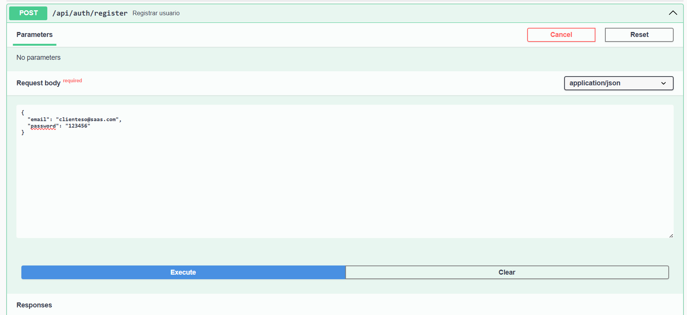

### Respuesta Exitosa

```json
{
  "message": "Usuario registrado correctamente",
  "access_token": "JWT_TOKEN"
}
```

### Evidencia de la respuesta

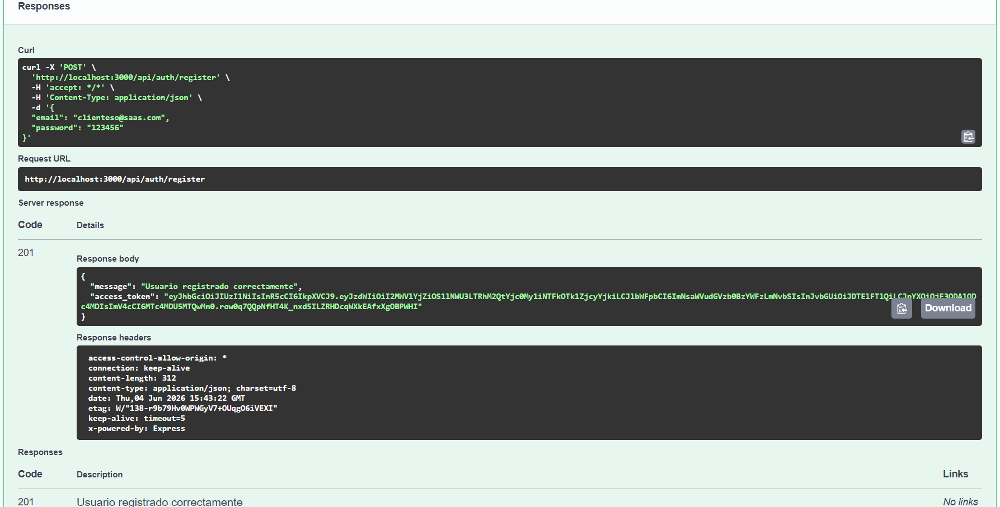

---

## Iniciar Sesión

**Endpoint**

```http
POST /api/auth/login
```

### Descripción

Permite autenticar un usuario existente mediante correo electrónico y contraseña. Si las credenciales son válidas, el sistema devuelve un token JWT.

### Solicitud

```json
{
  "email": "admin@saas.com",
  "password": "Admin123*"
}
```

### Evidencia de la solicitud

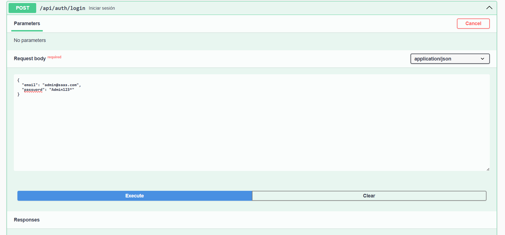

### Respuesta Exitosa

```json
{
  "access_token": "JWT_TOKEN"
}
```

### Evidencia de la respuesta

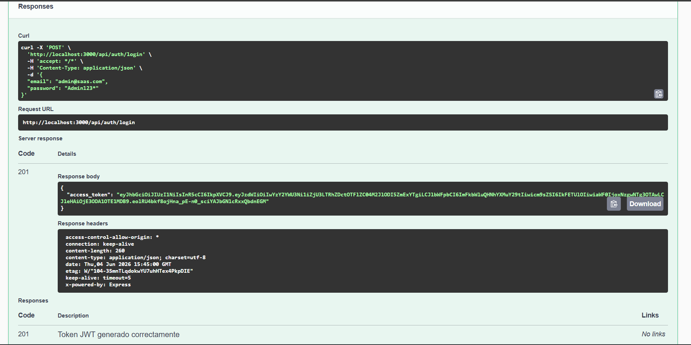

---

## Uso del Token JWT

Una vez autenticado, el token JWT debe enviarse en las peticiones protegidas mediante el encabezado:

```http
Authorization: Bearer <token>
```

Este token será utilizado para acceder a los módulos protegidos del sistema como:

- Usuarios
- Servicios
- Operaciones

según los permisos asignados al rol del usuario autenticado.

# Módulo de Servicios (Services)

Este módulo permite la gestión de los servicios ofrecidos por la plataforma SaaS.

---

## Crear Servicio

**Endpoint**

```http
POST /services
```

### Descripción

Permite registrar un nuevo servicio en el sistema. Solo los usuarios con rol **ADMIN** tienen acceso a esta operación.

### Autenticación

```http
Authorization: Bearer <token>
```

### Solicitud

```json
{
  "name": "Hosting Premium",
  "description": "Servicio de alojamiento web con soporte 24/7",
  "price": 49.99
}
```

### Evidencia de la solicitud

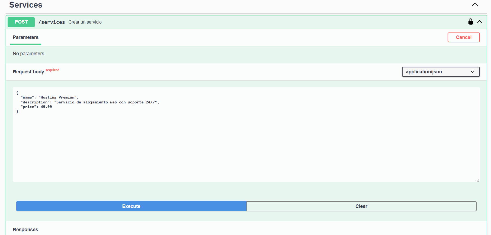

### Respuesta Exitosa

```json
{
  "id": "685bdd4f-0dbe-4f71-b3b3-35ab27e3d63f",
  "name": "Hosting Premium",
  "description": "Servicio de alojamiento web con soporte 24/7",
  "price": "49.99",
  "isActive": true,
  "createdAt": "2026-06-04T14:52:46.408Z"
}
```

### Evidencia de la respuesta

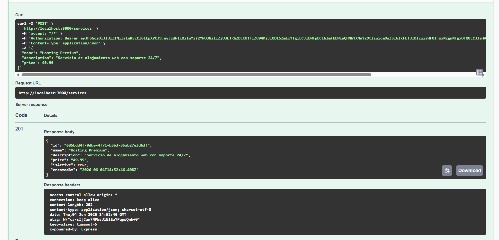

---

## Obtener Todos los Servicios

**Endpoint**

```http
GET /services
```

### Descripción

Permite consultar la lista completa de servicios registrados en la plataforma.

### Autenticación

```http
Authorization: Bearer <token>
```

### Evidencia de la solicitud


### Respuesta Exitosa

```json
[
  {
    "id": "685bdd4f-0dbe-4f71-b3b3-35ab27e3d63f",
    "name": "Servicio Premium",
    "description": "Servicio actualizado con nuevas características",
    "price": "150000",
    "isActive": true,
    "createdAt": "2026-06-04T14:52:46.408Z"
  }
]
```

### Evidencia de la respuesta

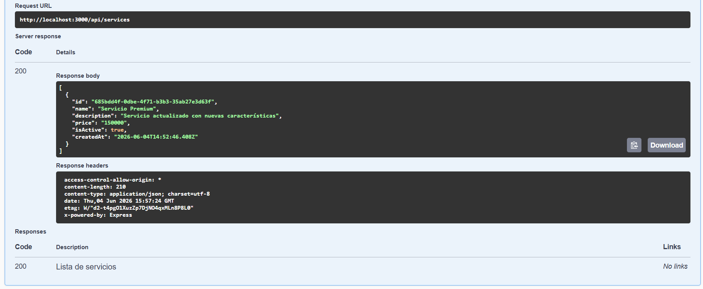

---

## Roles con acceso

| Endpoint | ADMIN | OPERATOR | CLIENT |
|-----------|---------|---------|---------|
| POST /services | ✅ | ❌ | ❌ |
| GET /services | ✅ | ✅ | ✅ |
| GET /services/:id | ✅ | ✅ | ✅ |
| PATCH /services/:id | ✅ | ❌ | ❌ |
| DELETE /services/:id | ✅ | ❌ | ❌ |

---

## Notas

- Todos los servicios se almacenan en la base de datos mediante Prisma ORM.
- Los servicios pueden ser utilizados posteriormente para la creación de operaciones.
- El acceso está protegido mediante JWT y control de roles.

---

## Obtener Servicio por ID

**Endpoint**

```http
GET /services/{id}
```

### Descripción

Permite consultar la información de un servicio específico utilizando su identificador único.

### Autenticación

```http
Authorization: Bearer <token>
```

### Parámetro de Ruta

| Parámetro | Tipo | Descripción |
|-----------|------|-------------|
| id | UUID | Identificador único del servicio |

### Evidencia de la solicitud

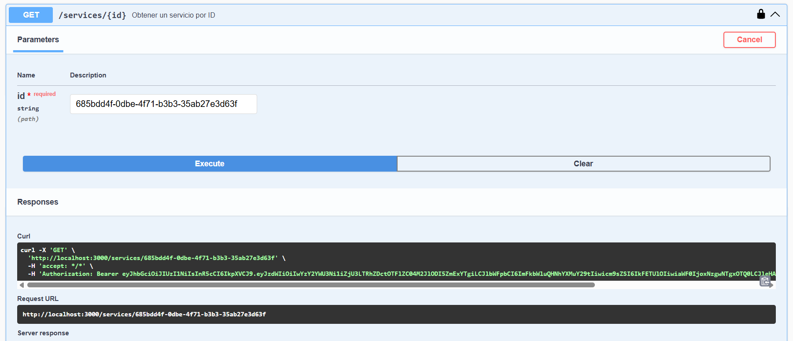

### Respuesta Exitosa

```json
{
  "id": "685bdd4f-0dbe-4f71-b3b3-35ab27e3d63f",
  "name": "Hosting Premium",
  "description": "Servicio de alojamiento web con soporte 24/7",
  "price": "49.99",
  "isActive": true,
  "createdAt": "2026-06-04T14:52:46.408Z"
}
```

### Evidencia de la respuesta

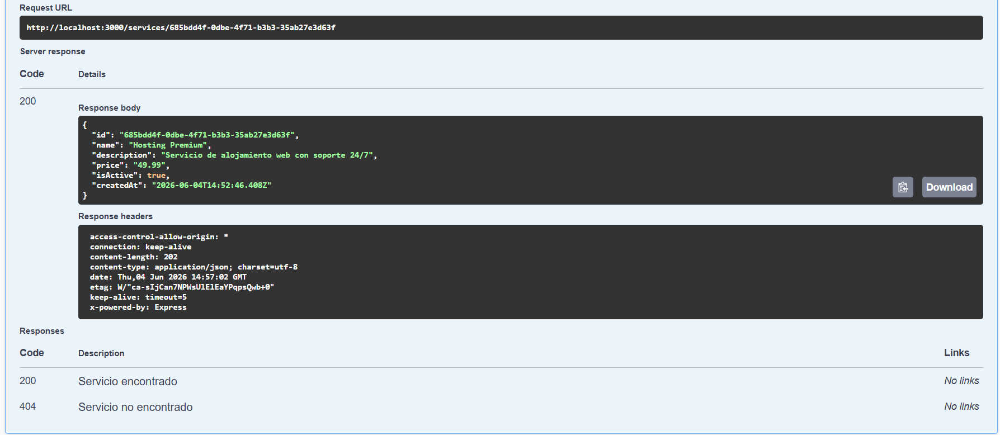

### Códigos de respuesta

| Código | Descripción |
|----------|-------------|
| 200 | Servicio encontrado |
| 404 | Servicio no encontrado |

---

## Actualizar Servicio

**Endpoint**

```http
PATCH /services/{id}
```

### Descripción

Permite actualizar la información de un servicio existente.

### Autenticación

```http
Authorization: Bearer <token>
```

### Parámetro de Ruta

| Parámetro | Tipo | Descripción |
|-----------|------|-------------|
| id | UUID | Identificador único del servicio |

### Solicitud

```json
{
  "name": "Servicio Premium",
  "description": "Servicio actualizado con nuevas características",
  "price": 150000
}
```

### Evidencia de la solicitud

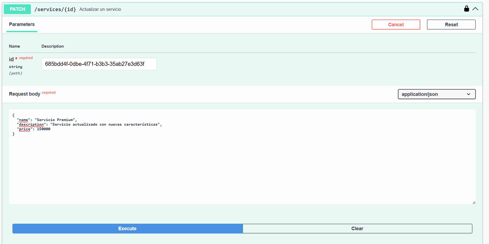

### Respuesta Exitosa

```json
{
  "id": "685bdd4f-0dbe-4f71-b3b3-35ab27e3d63f",
  "name": "Servicio Premium",
  "description": "Servicio actualizado con nuevas características",
  "price": "150000",
  "isActive": true,
  "createdAt": "2026-06-04T14:52:46.408Z"
}
```

### Evidencia de la respuesta

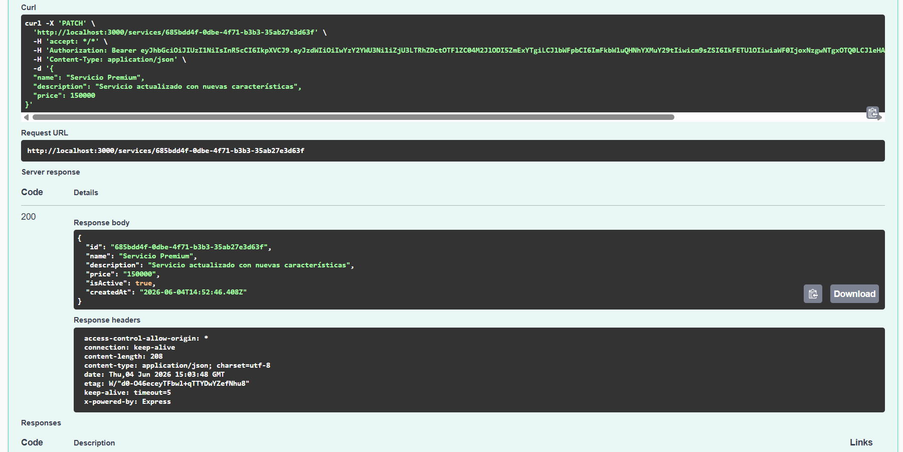

### Códigos de respuesta

| Código | Descripción |
|----------|-------------|
| 200 | Servicio actualizado correctamente |
| 404 | Servicio no encontrado |

---

## Eliminar Servicio

**Endpoint**

```http
DELETE /services/{id}
```

### Descripción

Permite eliminar un servicio existente del sistema.

### Autenticación

```http
Authorization: Bearer <token>
```

### Parámetro de Ruta

| Parámetro | Tipo | Descripción |
|-----------|------|-------------|
| id | UUID | Identificador único del servicio |

### Evidencia de la solicitud

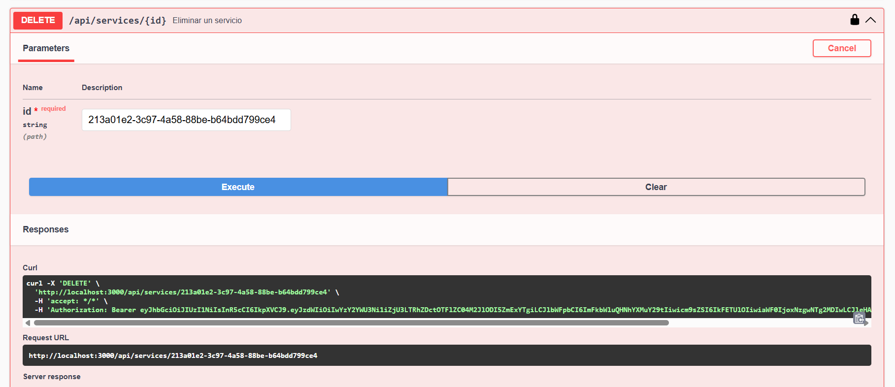

### Respuesta Exitosa

```json
{
  "id": "213a01e2-3c97-4a58-88be-b64bdd799ce4",
  "name": "Hosting Premium",
  "description": "Servicio de alojamiento web con soporte 24/7",
  "price": "49.99",
  "isActive": true,
  "createdAt": "2026-06-04T15:14:57.826Z"
}
```

### Evidencia de la respuesta

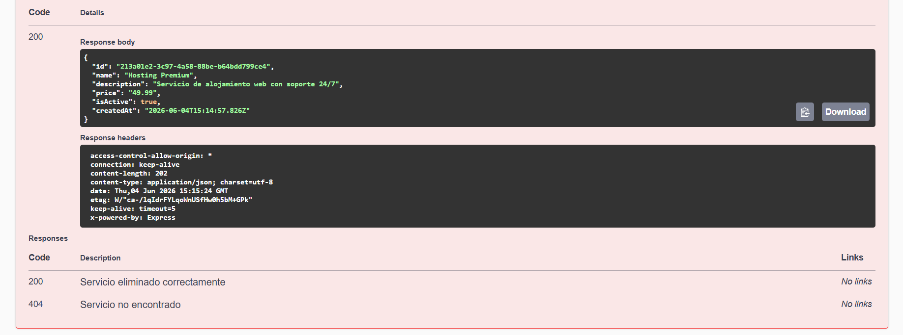

### Códigos de respuesta

| Código | Descripción |
|----------|-------------|
| 200 | Servicio eliminado correctamente |
| 404 | Servicio no encontrado |

---

## Roles con acceso

| Endpoint | ADMIN | OPERATOR | CLIENT |
|-----------|---------|---------|---------|
| POST /services | ✅ | ❌ | ❌ |
| GET /services | ✅ | ✅ | ✅ |
| GET /services/{id} | ✅ | ✅ | ✅ |
| PATCH /services/{id} | ✅ | ❌ | ❌ |
| DELETE /services/{id} | ✅ | ❌ | ❌ |

# Operations

## Crear Operación

**Endpoint**

```http
POST /api/operations
```

### Descripción

Permite registrar una nueva operación asociando un usuario con un servicio y almacenando el precio final de la compra.

### Autenticación

```http
Authorization: Bearer <token>
```

### Request Body

```json
{
  "userId": "0b1b646c-c041-45df-b3ea-316c9c2c1e63",
  "serviceId": "685bdd4f-0dbe-4f71-b3b3-35ab27e3d63f",
  "finalPrice": 150000
}
```

### Evidencia de la solicitud

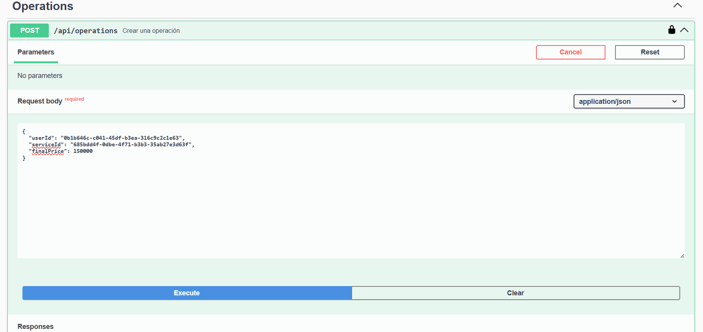

### Respuesta Exitosa

```json
{
  "id": "7066a39a-6620-41f2-a9fb-1afd3bc57880",
  "userId": "0b1b646c-c041-45df-b3ea-316c9c2c1e63",
  "serviceId": "685bdd4f-0dbe-4f71-b3b3-35ab27e3d63f",
  "finalPrice": "150000",
  "createdAt": "2026-06-04T15:23:41.163Z"
}
```

### Evidencia de la respuesta

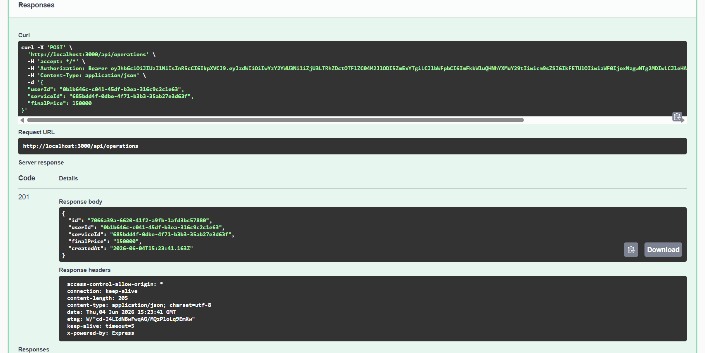

### Códigos de respuesta

| Código | Descripción |
|----------|-------------|
| 201 | Operación creada correctamente |
| 400 | Datos inválidos |
| 401 | No autorizado |

---

## Obtener Mis Operaciones

**Endpoint**

```http
GET /api/operations/my
```

### Descripción

Permite consultar únicamente las operaciones asociadas al usuario autenticado.

### Autenticación

```http
Authorization: Bearer <token>
```

### Evidencia de la solicitud

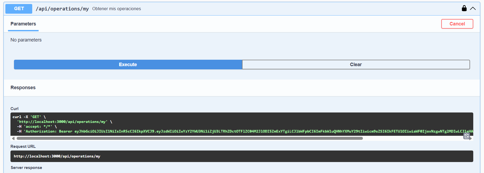

### Respuesta Exitosa

```json
[]
```

### Evidencia de la respuesta

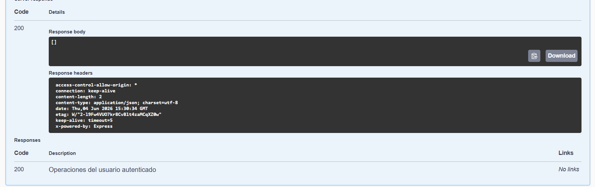

### Códigos de respuesta

| Código | Descripción |
|----------|-------------|
| 200 | Operaciones del usuario autenticado |
| 401 | No autorizado |

---

## Obtener Todas las Operaciones

**Endpoint**

```http
GET /api/operations
```

### Descripción

Permite consultar todas las operaciones registradas en el sistema junto con la información del usuario y servicio relacionado.

### Autenticación

```http
Authorization: Bearer <token>
```

### Evidencia de la solicitud

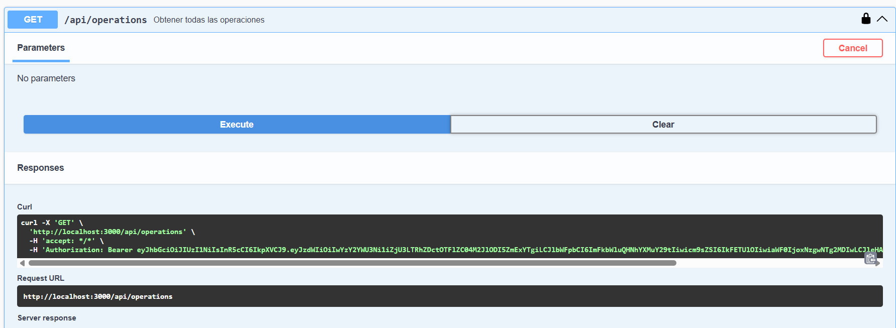

### Respuesta Exitosa

```json
[
  {
    "id": "7066a39a-6620-41f2-a9fb-1afd3bc57880",
    "userId": "0b1b646c-c041-45df-b3ea-316c9c2c1e63",
    "serviceId": "685bdd4f-0dbe-4f71-b3b3-35ab27e3d63f",
    "finalPrice": "150000",
    "createdAt": "2026-06-04T15:23:41.163Z",
    "user": {
      "id": "0b1b646c-c041-45df-b3ea-316c9c2c1e63",
      "email": "cliente@saas.com",
      "role": "CLIENT"
    },
    "service": {
      "id": "685bdd4f-0dbe-4f71-b3b3-35ab27e3d63f",
      "name": "Servicio Premium",
      "description": "Servicio actualizado con nuevas características",
      "price": "150000",
      "isActive": true
    }
  }
]
```

### Evidencia de la respuesta

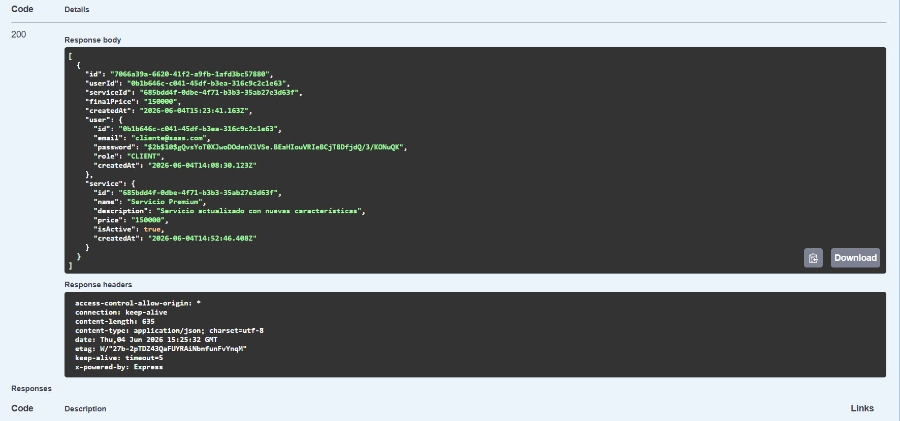

### Códigos de respuesta

| Código | Descripción |
|----------|-------------|
| 200 | Lista de operaciones |
| 401 | No autorizado |

---

## Obtener Operación por ID

**Endpoint**

```http
GET /api/operations/{id}
```

### Descripción

Permite consultar una operación específica mediante su identificador único, incluyendo la información relacionada del usuario y del servicio.

### Autenticación

```http
Authorization: Bearer <token>
```

### Parámetros

| Parámetro | Tipo | Descripción |
|------------|------|-------------|
| id | UUID | Identificador de la operación |

### Evidencia de la solicitud


### Respuesta Exitosa

```json
{
  "id": "7066a39a-6620-41f2-a9fb-1afd3bc57880",
  "userId": "0b1b646c-c041-45df-b3ea-316c9c2c1e63",
  "serviceId": "685bdd4f-0dbe-4f71-b3b3-35ab27e3d63f",
  "finalPrice": "150000",
  "createdAt": "2026-06-04T15:23:41.163Z",
  "user": {
    "id": "0b1b646c-c041-45df-b3ea-316c9c2c1e63",
    "email": "cliente@saas.com",
    "role": "CLIENT"
  },
  "service": {
    "id": "685bdd4f-0dbe-4f71-b3b3-35ab27e3d63f",
    "name": "Servicio Premium",
    "description": "Servicio actualizado con nuevas características",
    "price": "150000",
    "isActive": true
  }
}
```

### Evidencia de la respuesta

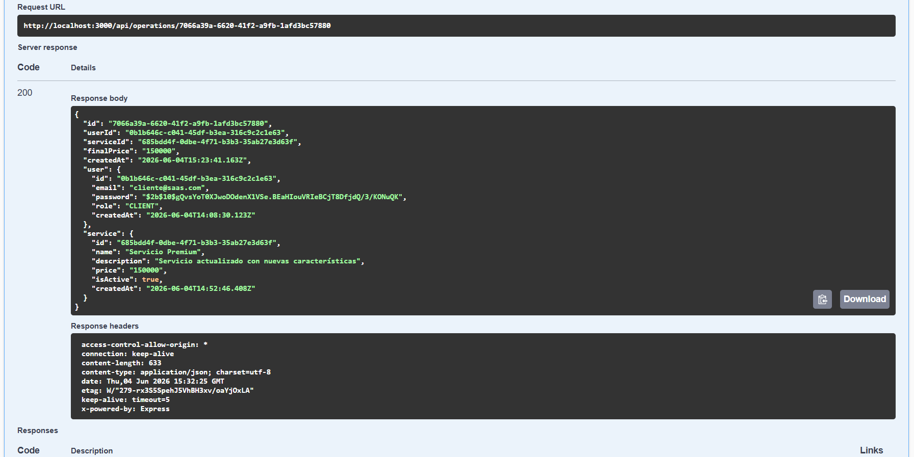

### Códigos de respuesta

| Código | Descripción |
|----------|-------------|
| 200 | Operación encontrada |
| 404 | Operación no encontrada |
| 401 | No autorizado |

---

## Actualizar Operación

**Endpoint**

```http
PATCH /api/operations/{id}
```

### Descripción

Permite actualizar la información de una operación existente modificando el usuario asociado, el servicio o el precio final.

### Autenticación

```http
Authorization: Bearer <token>
```

### Parámetros

| Parámetro | Tipo | Descripción |
|------------|------|-------------|
| id | UUID | Identificador de la operación |

### Request Body

```json
{
  "userId": "0b1b646c-c041-45df-b3ea-316c9c2c1e63",
  "serviceId": "685bdd4f-0dbe-4f71-b3b3-35ab27e3d63f",
  "finalPrice": 200000
}
```

### Evidencia de la solicitud

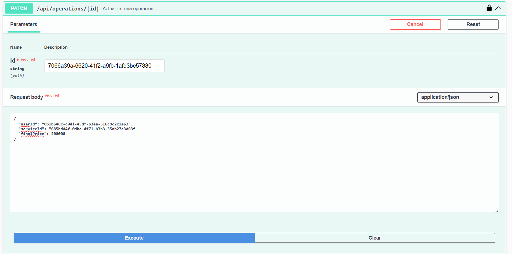

### Respuesta Exitosa

```json
{
  "id": "7066a39a-6620-41f2-a9fb-1afd3bc57880",
  "userId": "0b1b646c-c041-45df-b3ea-316c9c2c1e63",
  "serviceId": "685bdd4f-0dbe-4f71-b3b3-35ab27e3d63f",
  "finalPrice": "200000",
  "createdAt": "2026-06-04T15:23:41.163Z"
}
```

### Evidencia de la respuesta

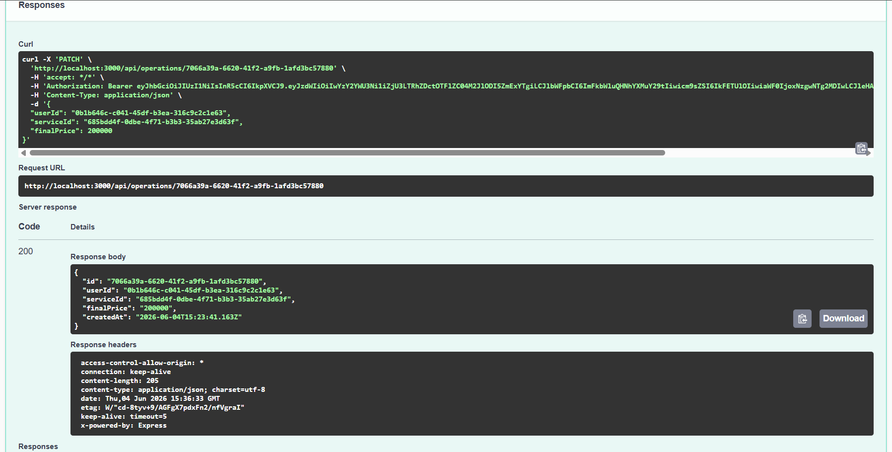

### Códigos de respuesta

| Código | Descripción |
|----------|-------------|
| 200 | Operación actualizada correctamente |
| 400 | Datos inválidos |
| 404 | Operación no encontrada |
| 401 | No autorizado |

---

## Eliminar Operación

**Endpoint**

```http
DELETE /api/operations/{id}
```

### Descripción

Permite eliminar una operación registrada mediante su identificador único.

### Autenticación

```http
Authorization: Bearer <token>
```

### Parámetros

| Parámetro | Tipo | Descripción |
|-----------|------|-------------|
| id | UUID | Identificador de la operación |

### Evidencia de la solicitud

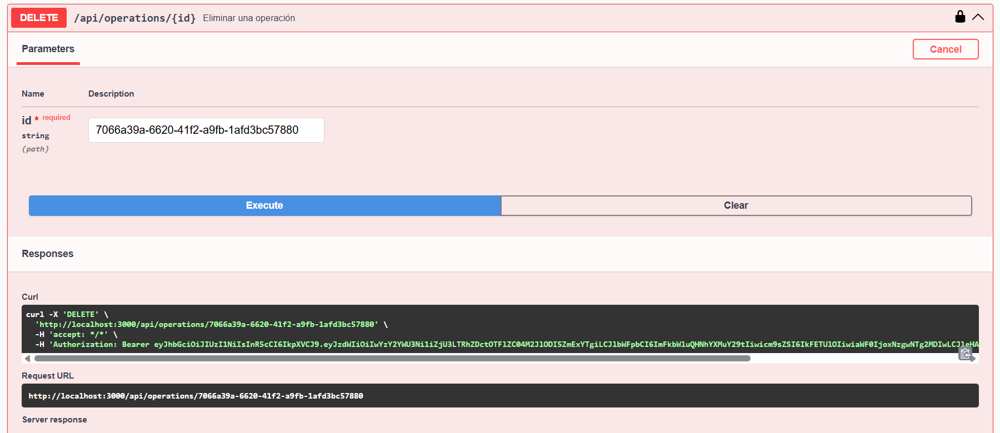

### Respuesta Exitosa

```json
{
  "id": "7066a39a-6620-41f2-a9fb-1afd3bc57880",
  "userId": "0b1b646c-c041-45df-b3ea-316c9c2c1e63",
  "serviceId": "685bdd4f-0dbe-4f71-b3b3-35ab27e3d63f",
  "finalPrice": "200000",
  "createdAt": "2026-06-04T15:23:41.163Z"
}
```

### Evidencia de la respuesta

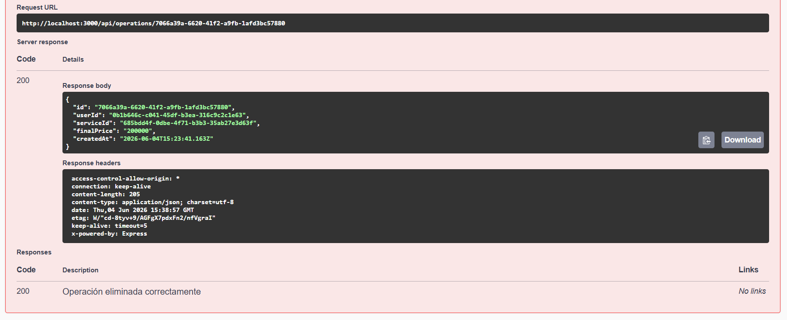

### Códigos de respuesta

| Código | Descripción |
|---------|-------------|
| 200 | Operación eliminada correctamente |
| 404 | Operación no encontrada |
| 401 | No autorizado |

---

## Crear Usuario

**Endpoint**

```http
POST /users
```

### Descripción

Permite registrar un nuevo usuario en el sistema indicando correo electrónico, contraseña y rol.

### Autenticación

```http
Authorization: Bearer <token>
```

### Request Body

```json
{
  "email": "cliente100@saas.com",
  "password": "123456",
  "role": "CLIENT"
}
```

### Evidencia de la solicitud

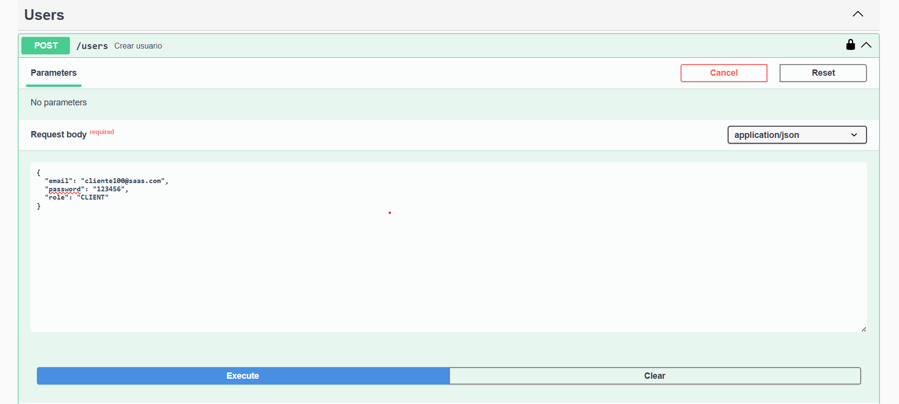

### Respuesta Exitosa

```json
{
  "id": "2a72cdd1-9282-45c1-b580-f473a2cc4600",
  "email": "cliente100@saas.com",
  "password": "$2b$10$XkzDhDxUDCfThm6uNed6e.J8P.BDvMBxmv7NhsHcJrkMoGuf3rCRu",
  "role": "CLIENT",
  "createdAt": "2026-06-04T14:34:29.131Z"
}
```

### Evidencia de la respuesta

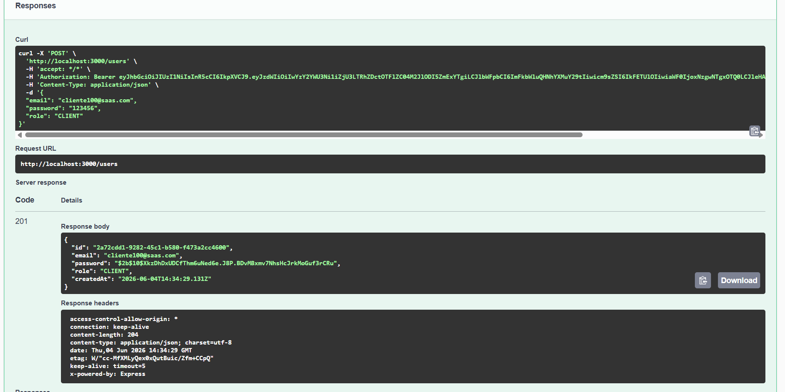

### Códigos de respuesta

| Código | Descripción |
|----------|-------------|
| 201 | Usuario creado correctamente |
| 400 | Datos inválidos |
| 401 | No autorizado |

---

## Obtener Todos los Usuarios

**Endpoint**

```http
GET /users
```

### Descripción

Permite consultar todos los usuarios registrados en el sistema.

### Autenticación

```http
Authorization: Bearer <token>
```

### Evidencia de la solicitud

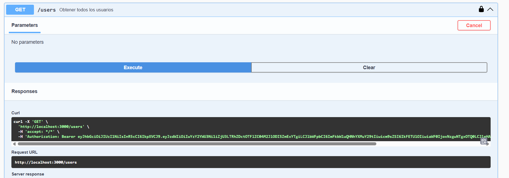

### Respuesta Exitosa

```json
[
  {
    "id": "0c66ae76-bf57-4ad7-91ed-83be829fa1a8",
    "email": "admin@saas.com",
    "role": "ADMIN"
  },
  {
    "id": "96c1d242-f3ae-4ff1-b861-c4a34f3a1934",
    "email": "operator@saas.com",
    "role": "OPERATOR"
  },
  {
    "id": "e43f07d3-f0d0-4817-8256-cfb971bb33c8",
    "email": "client@saas.com",
    "role": "CLIENT"
  }
]
```

### Evidencia de la respuesta

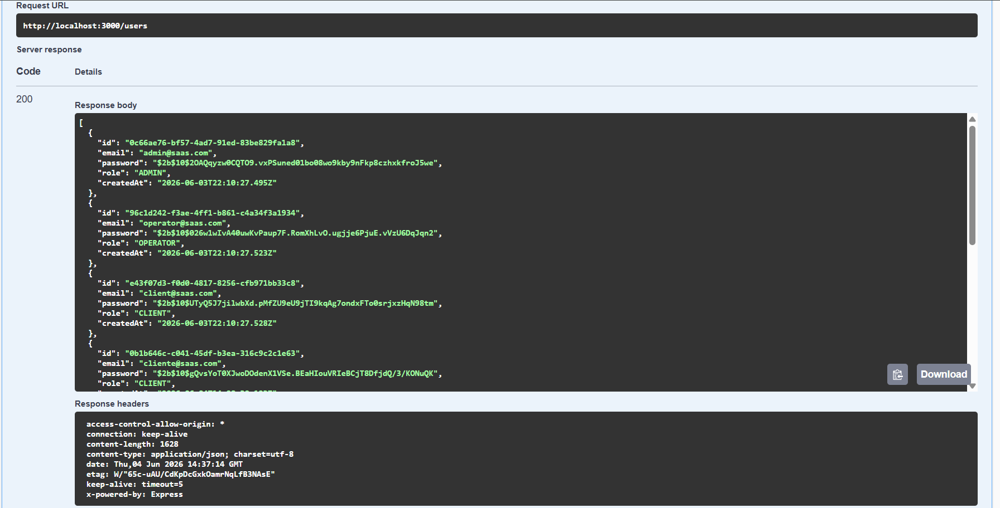

### Códigos de respuesta

| Código | Descripción |
|----------|-------------|
| 200 | Lista de usuarios obtenida correctamente |
| 401 | No autorizado |

---

## Obtener Usuario por ID

**Endpoint**

```http
GET /users/{id}
```

### Descripción

Permite consultar la información de un usuario específico mediante su identificador único.

### Autenticación

```http
Authorization: Bearer <token>
```

### Parámetros

| Parámetro | Tipo | Descripción |
|------------|------|-------------|
| id | UUID | Identificador del usuario |

### Evidencia de la solicitud

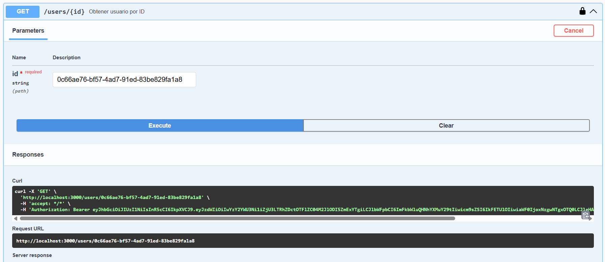

### Respuesta Exitosa

```json
{
  "id": "0c66ae76-bf57-4ad7-91ed-83be829fa1a8",
  "email": "admin@saas.com",
  "password": "$2b$10$20AQqyzw0CQT09.vxPSuned01bo08wo9kby9nFkp8czhxkfroJ5we",
  "role": "ADMIN",
  "createdAt": "2026-06-03T22:10:27.495Z"
}
```

### Evidencia de la respuesta

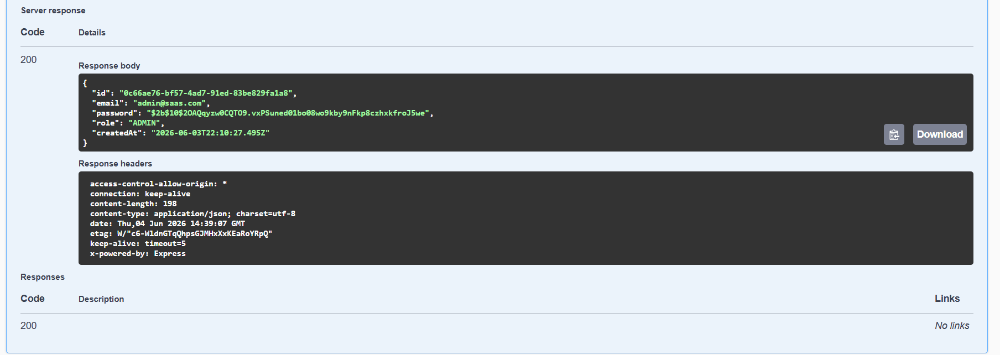

### Códigos de respuesta

| Código | Descripción |
|----------|-------------|
| 200 | Usuario encontrado |
| 404 | Usuario no encontrado |
| 401 | No autorizado |

---

## Actualizar Usuario

**Endpoint**

```http
PATCH /users/{id}
```

### Descripción

Permite actualizar la información de un usuario existente mediante su identificador único.

### Autenticación

```http
Authorization: Bearer <token>
```

### Parámetros

| Parámetro | Tipo | Descripción |
|------------|------|-------------|
| id | UUID | Identificador del usuario |

### Request Body

```json
{
  "email": "cliente200@saas.com",
  "password": "123456",
  "role": "CLIENT"
}
```

### Evidencia de la solicitud

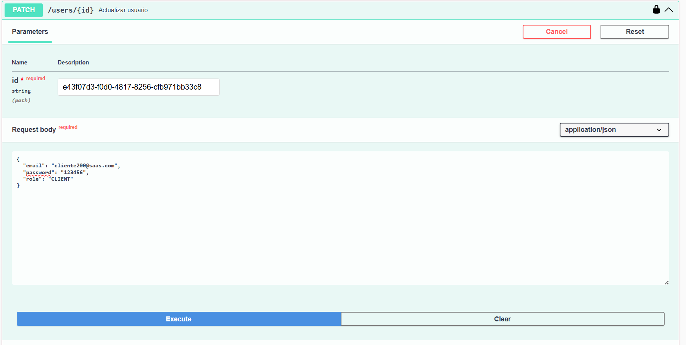

### Respuesta Exitosa

```json
{
  "id": "e43f07d3-f0d0-4817-8256-cfb971bb33c8",
  "email": "cliente200@saas.com",
  "password": "$2b$10$U0x8vaYTzF7Rj0hNezZcMO7jCwNF499BZpmOSx2hpViRqhyQDHuE6",
  "role": "CLIENT",
  "createdAt": "2026-06-03T22:10:27.528Z"
}
```

### Evidencia de la respuesta

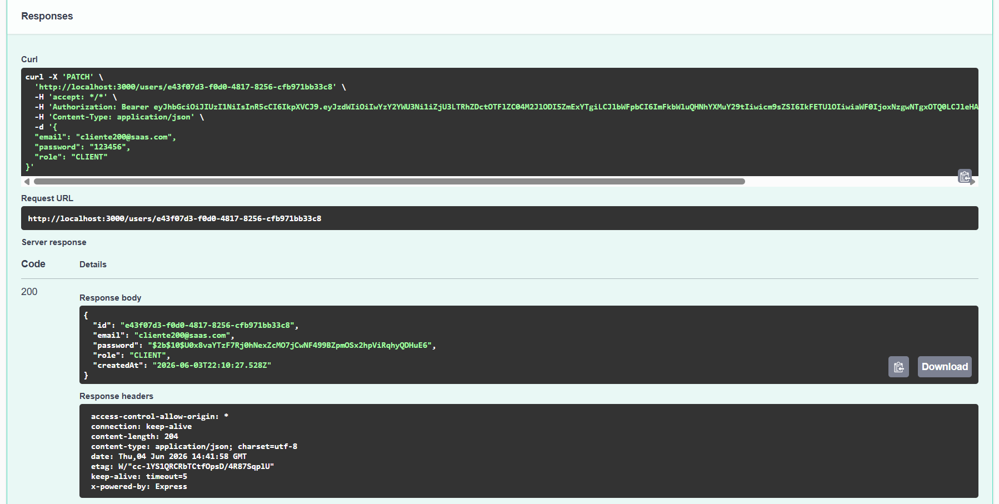

### Códigos de respuesta

| Código | Descripción |
|----------|-------------|
| 200 | Usuario actualizado correctamente |
| 400 | Datos inválidos |
| 404 | Usuario no encontrado |
| 401 | No autorizado |

---

## Eliminar Usuario

**Endpoint**

```http
DELETE /users/{id}
```

### Descripción

Permite eliminar un usuario registrado mediante su identificador único.

### Autenticación

```http
Authorization: Bearer <token>
```

### Parámetros

| Parámetro | Tipo | Descripción |
|------------|------|-------------|
| id | UUID | Identificador del usuario |

### Evidencia de la solicitud

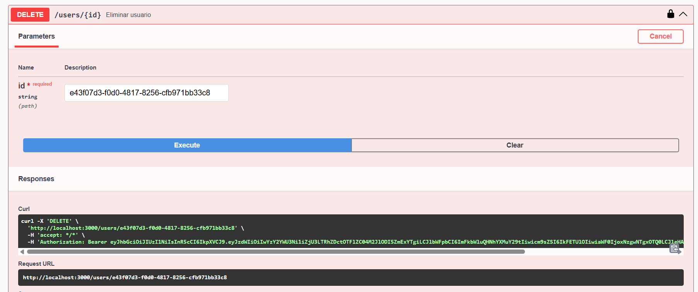

### Respuesta Exitosa

```json
{
  "id": "e43f07d3-f0d0-4817-8256-cfb971bb33c8",
  "email": "cliente200@saas.com",
  "password": "$2b$10$U0x8vaYTzF7Rj0hNezZcMO7jCwNF499BZpmOSx2hpViRqhyQDHuE6",
  "role": "CLIENT",
  "createdAt": "2026-06-03T22:10:27.528Z"
}
```

### Evidencia de la respuesta

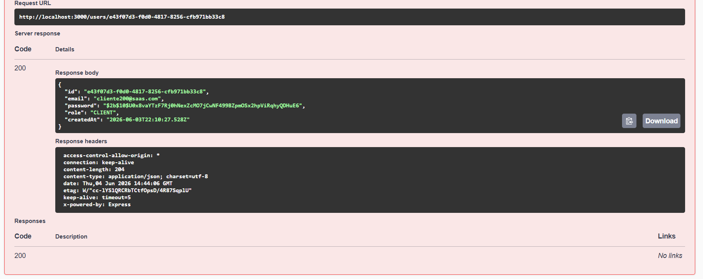

### Códigos de respuesta

| Código | Descripción |
|----------|-------------|
| 200 | Usuario eliminado correctamente |
| 404 | Usuario no encontrado |
| 401 | No autorizado |

---